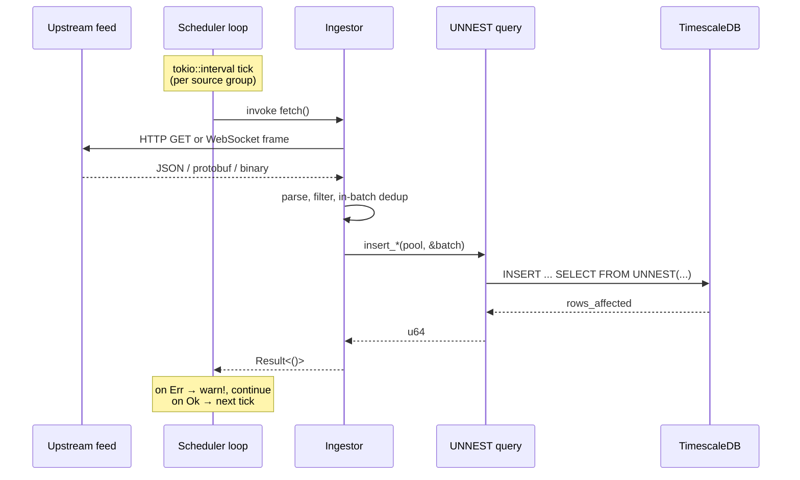

# Architecture

This document describes the design of `trajectory`, the reasoning behind
each non-trivial decision, and the known gaps. It is written for someone
who reads [`src/`](src/) in parallel; every claim points at the specific
file and function where it is realized.

---

## 1. Problem Statement

Real-time vehicle tracking data is scattered across heterogeneous feeds:
authenticated REST APIs (OpenSky), anonymous REST snapshots (adsb.fi),
authenticated REST with session cookies (private feeders), compressed
WebSockets (AIS Stream), large periodic protobufs (GTFS-RT), and daily
ZIP bundles (GTFS static). A hobbyist or researcher who wants to ask
questions like *"how did Swiss train delays evolve over the last 90
days?"* or *"show me ship density in the English Channel last week"*
cannot do so without a persistent ingestion layer that normalizes these
feeds into one queryable store.

`trajectory` is that layer. It is deliberately scoped to a single box
(homelab scale) because adding a distributed-systems dimension on top
would 10x the surface area for no gain at this volume.

## 2. Design Goals

Concrete, measurable targets, each reflected in a decision below.

| Goal | Target | Status |
|---|---|---|
| Throughput | Sustain ≥ 100 rec/s average, absorb 500 rec/s bursts | 117 rec/s avg, 468 rec/s peak-1min (measured) |
| Memory | Steady-state RSS ≤ 1 GB | ~200–400 MB observed; GTFS-RT pushes to ~1 GB during 34 MB protobuf decode |
| Durability | No data loss acceptable beyond WAL flush window (~200 ms) | `synchronous_commit = off`; upstream can be re-fetched |
| Operational simplicity | Single binary, single systemd unit, zero runtime dependencies beyond `libc` + OpenSSL-free TLS | `rustls` + `aws-lc-rs`, no OpenSSL; binary is 8.3 MB stripped |
| Restart safety | Daemon can be `systemctl restart`ed at any moment; losing an in-flight batch is acceptable | no transactional ingest; next tick refetches |

Latency SLOs (p50/p99 ingest latency) are **not** set because they are
not instrumented. See §4.9 and §7.

## 3. Data Flow



The scheduler ([`src/scheduler/simple.rs`](src/scheduler/simple.rs))
owns one `tokio::spawn` per source group; within a group, ingestors run
sequentially. The AIS ingestor is the exception: it owns a persistent
WebSocket that runs its own loop ([`src/ingestors/ais.rs`](src/ingestors/ais.rs),
`run_continuous`).

All bulk writes go through
[`src/storage/queries.rs`](src/storage/queries.rs), which exposes one
`insert_*` function per hypertable. Every function builds per-column
arrays, binds them via `sqlx`, and issues a single
`INSERT INTO … SELECT … FROM UNNEST(…)`.

## 4. Key Design Decisions

### 4.1 Rust (not Go, not Python)

Go would be a natural second choice. The decisive factors were:

- Tight memory envelope. `tokio` + `reqwest` + `sqlx` on release-profile
  gives me a binary that idles around 200 MB RSS on the target host.
  Equivalent Go code with `net/http` + `pgx` consistently sat 1.5-2×
  higher in earlier prototypes of adjacent projects, largely because
  of Go's GC headroom.
- `yawc` exists in Rust and implements `permessage-deflate`. In Go I
  would have needed to patch `gorilla/websocket` or switch to
  `nhooyr.io/websocket`, both of which had incomplete deflate support
  at the time I wrote this.
- Compile-time guarantees on the column-order of `UNNEST` bindings.
  Getting a `Vec<Option<&str>>` where a `Vec<Option<i32>>` was expected
  is a `sqlx` compile error, not a runtime surprise on row 50 million.

Python was never on the table for a 24/7 ingest daemon at 100+ rec/s
with 730 M AIS rows in three months; GIL + import cost + per-request
overhead would have required either a C extension for the hot path or
a significantly more complex process model.

### 4.2 Multi-threaded Tokio runtime

The daemon runs on `tokio::rt-multi-thread` (see `tokio` features in
[`Cargo.toml`](Cargo.toml) and the default `#[tokio::main]`
expansion in [`src/main.rs`](src/main.rs)). Worker count defaults to
`num_cpus`.

- **Alternative considered:** `current_thread` (single-threaded).
  Cheaper context switches, no `Send` requirements on futures.
- **Why not:** the GTFS-RT decode path is a single-shot
  `FeedMessage::decode(&*bytes)` on a 28-34 MB protobuf
  ([`src/ingestors/gtfs_realtime.rs`](src/ingestors/gtfs_realtime.rs)).
  On one core this blocks all other ingestors for the duration of the
  decode (observed: 300-600 ms). With workers, the decode runs on a
  parked thread and the AIS stream keeps flowing.
- **Tradeoff:** all futures must be `Send`. This has caused exactly
  zero friction in this codebase because all ingestor state is either
  owned locally or is `Arc<PgPool>`.

### 4.3 `tokio::interval` scheduler (not `tokio-cron-scheduler`)

Predecessors of this daemon used `tokio-cron-scheduler`. It allocated
`Arc<Job>` handles without bound and the process leaked memory at
roughly 10-30 MB/day, eventually triggering systemd's `MemoryHigh`
pressure and a restart.

The current design
([`src/scheduler/simple.rs`](src/scheduler/simple.rs)) is a plain
`tokio::interval` per source group with
`MissedTickBehavior::Skip`. This is ~40 lines of code, zero external
state, and has been stable for weeks at constant RSS.

- **Skip, not Burst or Delay:** if a tick is late because an ingestor
  is slow, we drop the catch-up rather than fire multiple ticks in
  quick succession. The goal is steady state, not make-up work.

### 4.4 Sequential execution within source groups

`run_flights_loop` invokes OpenSky → adsb.lol → airplanes.live →
ADSB One → adsb.fi one after another
([`src/scheduler/simple.rs`](src/scheduler/simple.rs)).

- **Alternative considered:** `FuturesUnordered` with a bounded
  concurrency limit.
- **Why not:** peak memory. Each ADS-B source pulls a 2-8 MB JSON
  payload, deserializes via `serde` (peaks at ~3× payload size), and
  holds the `Vec<Flight>` until insertion returns. Running five of
  these concurrently would push the heap past the ~1 GB envelope I
  wanted to keep.
- **Tradeoff:** a 5-minute tick in practice spans about 90 seconds of
  sequential work. Perfectly fine here because the data has 5-minute
  resolution anyway.

### 4.5 PostgreSQL 15 + PostGIS baseline, TimescaleDB as optional upgrade

The reference deployment runs plain PostgreSQL with PostGIS only. At
~980 M rows across 97 days, this worked without partitioning because:

- **Writes are append-only.** Every ingestor produces new rows; there
  are no updates, no hot-spot pages, no UPDATE-induced bloat.
- **Reads are time-windowed.** Every Grafana panel filters on recent
  time; `idx_*_time (timestamp DESC)` lets PostgreSQL satisfy those
  without a full scan.
- **`synchronous_commit = off`** moves the WAL fsync out of the critical
  path (§4.7).

That said, "works now" is not "works at 10 B rows". Two real concerns
that TimescaleDB addresses cleanly:

| Concern | When it bites | TimescaleDB answer |
|---|---|---|
| Index size on `(timestamp)` | when the index no longer fits in `shared_buffers` | per-chunk local indexes |
| VACUUM cost on giga-row tables | when `autovacuum` runs longer than the tick interval | VACUUM operates per chunk |

The migration path is explicit: [`sql/schema_timescaledb.sql`](sql/schema_timescaledb.sql)
runs `create_hypertable(..., migrate_data => TRUE)` against the
existing tables and registers compression policies (`segmentby =
source`/`mmsi`/`station_id`/`norad_id`). Retention hooks are driven
from the daemon via `RETENTION_*_DAYS` env vars — see
[`src/storage/retention.rs`](src/storage/retention.rs). The retention
code swallows the "function does not exist" error when TimescaleDB is
absent, so the daemon runs unmodified against either backend.

Continuous aggregates are **not** implemented in either mode. Grafana
currently scans raw tables with `date_trunc() GROUP BY`. This is cheap
enough at 97 days of data but is the obvious next optimization around
the 12-month mark. See §7.

### 4.6 Bulk inserts via `UNNEST` (not `COPY`, not per-row INSERT)

Every `insert_*` in [`src/storage/queries.rs`](src/storage/queries.rs)
follows the same shape:

```rust
INSERT INTO flights (...)
SELECT ... FROM UNNEST($1::timestamptz[], $2::text[], ...) AS t(...)
```

- **vs. per-row INSERT:** measured 50-100× faster on the target
  hardware, because WAL flushes and prepared-statement planning happen
  once per batch instead of once per row.
- **vs. `COPY ... FROM STDIN`:** `COPY` would be another ~2× faster
  but it bypasses prepared-statement caching, forces me to escape
  values manually (or use `pg_escape` crates), and does not play
  well with sqlx's type-checking. At 468 rec/s peak I am nowhere
  near needing `COPY`.
- **Array lifetime:** the arrays borrow from the caller
  (`Vec<Option<&str>>`, not `Vec<Option<String>>`) so we allocate
  one Vec per column per batch, not one allocation per row per
  column — see the pattern in `insert_flights`.

### 4.7 Connection pool: 10 max, 2 min, `synchronous_commit = off`

[`src/storage/pool.rs`](src/storage/pool.rs) opens a pool with:

```rust
.max_connections(10)
.min_connections(2)
.acquire_timeout(Duration::from_secs(30))
.idle_timeout(Duration::from_secs(600))
.after_connect(|conn, _| ... SET synchronous_commit = off ...)
```

- **Why 10:** peak concurrency is ~7 simultaneous writers (AIS session
  + up to 5 sequential HTTP ingestors + retention/compression
  background work). 10 gives headroom without wasting connection slots
  on an idle database.
- **Why `synchronous_commit = off`:** the trade is ≤200 ms of WAL
  durability at crash time for a significant throughput gain (WAL
  flush is the dominant insert latency at this workload). Because the
  daemon can always re-fetch upstream, this is a net positive.
- **Per-connection, not cluster-wide:** set via `after_connect` so it
  applies only to this pool. A co-tenant application on the same
  cluster is unaffected.

### 4.8 Error handling: `anyhow` throughout, typed errors in `src/error.rs`

- Every ingestor returns `anyhow::Result<()>`.
- The library surface
  ([`src/error.rs`](src/error.rs)) defines `ConfigError` and
  `IngestError` with `thiserror` for use by downstream consumers of
  the crate. The binary itself opts for `anyhow` because the errors
  it encounters are already rich enough via `#[from]` conversions and
  are never programmatically matched.
- **Transient errors** (HTTP 5xx, network timeout, DB connection
  drop): `warn!(error = %e, …)` and continue. The next tick retries.
  No explicit backoff — the tick interval is the backoff.
- **Upstream non-success** (HTTP 4xx): `warn!` and skip that source
  for this tick. The private feeder has a special 5-minute backoff on
  `"Login failed"` substrings
  ([`src/scheduler/simple.rs`](src/scheduler/simple.rs),
  `run_bratwurst_loop`) because cookie-session auth fails often and
  hammering the login endpoint invites a ban.
- **Panic** in a spawned task: `JoinHandle::await` surfaces it,
  scheduler logs and continues. A panic in the main task crashes the
  daemon; systemd restarts it in 10 s (`Restart=always`,
  `RestartSec=10`).

No retry counters, no exponential backoff, no circuit breakers. See §7.

### 4.9 Observability: structured logs + SQL-side latency

`tracing-subscriber` with an `EnvFilter` default of `info`
([`src/telemetry.rs`](src/telemetry.rs)). Logs are emitted as
structured key=value pairs and go to stdout, which systemd routes into
the journal.

Two complementary latency signals exist without any external
dependency:

- **Code side.** Every `insert_*` in
  [`src/storage/queries.rs`](src/storage/queries.rs) times its bulk
  write and emits a `debug!(table, count, batch, elapsed_ms, ...)`
  event. Run at `RUST_LOG=trajectory=debug` to capture per-batch
  timing.
- **SQL side.** Every hot table carries an `ingested_at TIMESTAMPTZ
  DEFAULT NOW()` column. Per-row wall-clock latency is
  `ingested_at - timestamp`; p50/p95/p99 are a `percentile_cont`
  away — queries in [`sql/queries/latency.sql`](sql/queries/latency.sql).
  This captures the full Rust→Postgres handoff, not just the INSERT.

Operational alerting lives in Grafana against the database (e.g. "no
flight inserts in 10 min" on `SELECT max(timestamp) FROM flights`,
"p99 ingest latency > 2 s over last 60 s" on the percentile query).

**Not implemented:**
- No Prometheus `/metrics` endpoint. Would be the right move for the
  next deployment tier — see §7.
- No trace context propagation (single process; not useful).

### 4.10 Deployment: systemd (not Docker, not Kubernetes)

- One binary, one host, no orchestrator. Docker would add a layer with
  zero operational value on a homelab box; K8s is an antipattern for
  a single-replica non-scalable workload.
- The hardened unit in
  [`systemd/trajectory.service`](systemd/trajectory.service) drops the
  ambient capability set, applies `NoNewPrivileges`,
  `ProtectSystem=strict`, `ProtectHome=yes`, `PrivateTmp`, a
  `@system-service` syscall filter, and restricts filesystem writes
  to `DATA_DIR` only.
- `Restart=always`, `RestartSec=10` covers the "daemon panicked"
  recovery path.

Docker is still used for the **database** — see
[`docker-compose.yml`](docker-compose.yml) — because TimescaleDB + PostGIS
are annoying to install on a bare Debian box and the container image is
well-maintained by Timescale.

## 5. Failure Modes

What happens when things go wrong. Each row is an observed or reasoned
scenario; "mitigation" is what the current code does, not what it
should do.

| Failure | What happens | Mitigation | Gap |
|---|---|---|---|
| Database unreachable on startup | `create_pool().await?` returns, `main` exits with error | systemd restarts in 10 s | none for now |
| Database unreachable mid-run | `insert_*` returns `sqlx::Error`, ingestor logs `warn!` and returns | next tick retries | in-flight batch lost |
| Upstream API returns 5xx | `fetch` logs `warn!` and returns `Ok(())` (for most sources) or an error (OpenSky, GTFS-RT) | next tick retries | no backoff, can hammer |
| Upstream API returns 429 | Same as 5xx | next tick still fires on schedule | no rate-limit-aware backoff |
| Malformed payload | `serde::from_slice` fails, record skipped silently inside `filter_map` | — | no counter, no visibility |
| AIS WebSocket drops | `while let Some(frame)` loop ends, outer loop reconnects after 5 s | automatic | no exponential backoff on repeated failures |
| OOM / process killed | systemd restart | — | in-flight AIS buffer (≤500 msgs) lost |
| Disk full | `sqlx::Error` on insert, logged, batch lost; retention policies do not run because they also write | — | no disk-space preflight |
| `systemctl restart` mid-batch | SIGTERM, main exits without draining | systemd default shutdown behavior | in-flight batches lost |
| Clock skew (host NTP broken) | timestamps in DB diverge from reality | — | not instrumented |
| AIS API key rejected | WebSocket disconnects, outer loop reconnects forever | — | no "give up and alert" path |
| Private feeder login throttled | `warn!` + 5 min backoff | — | after backoff, tries again forever |
| TimescaleDB extension missing | retention policy call logs `warn!`, daemon still runs | graceful degrade | inserts still succeed on plain tables |

None of these failure paths corrupt data: the worst case is lost
batches that upstream can resupply on the next tick.

## 6. Security Considerations

Threat model: the daemon is a pure egress service running on a single
host in a home network behind a NAT. It has no ingress, no listening
sockets, no user-facing API.

### 6.1 Credentials

- All credentials are read from environment variables (or a `.env`
  file) at startup by `Config::from_env`
  ([`src/config.rs`](src/config.rs)).
- Nothing is logged that contains a credential. Private feeder URLs
  and username are explicitly kept out of source and out of default
  values; see the Bratwurst section in `.env.example`.
- No credentials are persisted back to disk during runtime.

### 6.2 Outbound TLS

- All HTTPS uses `rustls` with `aws-lc-rs` as the crypto provider
  ([`src/main.rs`](src/main.rs), installed before any HTTP client is
  built). No OpenSSL on the code path.
- Root certificates come from `webpki-roots`. No custom CA trust.
- No code path sets `danger_accept_invalid_certs(true)`. (An earlier
  version did; it was removed during the audit — see `REVIEW_NOTES`.)
- AIS uses `tokio-rustls` with the same root store
  ([`src/ingestors/ais.rs`](src/ingestors/ais.rs), `tls_connector`).

### 6.3 Supply chain

- `Cargo.lock` is committed (binary crate). Reproducible builds at
  the exact dependency graph in use.
- No post-install build scripts depend on network access beyond
  `prost-build`, which compiles a committed `.proto` and does not
  fetch anything.
- Direct dependencies (≈20) are vetted; transitive is ≈200. No
  auto-update mechanism. `cargo audit` is not yet wired into CI —
  see §7.

### 6.4 Attack surface from untrusted input

Upstream APIs can return arbitrary bytes. We defend against:

- **Oversize bodies:** `reqwest` timeouts (30 s) bound response
  reception time, but do not bound bytes. In practice, all upstreams
  serve payloads ≤ 40 MB; a malicious response serving GBs would
  OOM the process. No explicit `Content-Length` check is performed.
- **Malformed JSON / protobuf:** `serde` and `prost` are memory-safe
  and return `Err` on invalid input. Record is silently dropped.
- **Unicode / encoding tricks in text fields:** `PostgreSQL` rejects
  invalid UTF-8; `serde_json` gives validated UTF-8 strings. Field
  lengths are not bounded at the application layer — relying on DB
  column types.
- **SQL injection via upstream strings:** eliminated by design —
  every insert is a parameterized `sqlx::query().bind(...)`, never
  string concatenation.

### 6.5 Database auth

- Connection via DSN in `DATABASE_URL`. Can be a password-based
  localhost connection (default) or a UNIX socket. TLS to the DB is
  supported by `sqlx` but not configured by default because the
  reference deployment has DB on the same host.

### 6.6 Systemd sandbox

See [`systemd/trajectory.service`](systemd/trajectory.service). The
unit is the last line of defense if the daemon is ever compromised
via a crafted upstream payload: capabilities are dropped, filesystem
writes are restricted to `DATA_DIR`, `/home`, `/root`, `/etc` are
read-only or invisible, `/tmp` is private, and the syscall filter
excludes `@mount`, `@debug`, `@module`, `@reboot`, `@swap`, etc.

## 7. What I'd Do Differently

Open-eyed list of known gaps. V1 is what ships; V2 is the version
that runs against this as its spec.

### 7.1 Observability

- **Prometheus `/metrics`.** Per-source insert rate, batch size
  histogram, upstream latency histogram, error counter by
  `(source, error_class)`. This single change would make the whole
  "what does the SLO look like?" question answerable instead of
  impossible.
- **Request-level tracing.** Even without export, `tracing` spans
  around each `fetch()` would expose tail latencies via
  `tracing-subscriber`'s fmt layer.
- **Counter for dropped records** inside `filter_map` paths. Right
  now a malformed payload is silently ignored.

### 7.2 Reliability

- **Exponential backoff with jitter** for transient upstream errors,
  ideally via a shared `governor` rate limiter keyed per upstream.
- **Circuit breaker per source.** After N consecutive failures, trip
  for M minutes, half-open on one probe. Useful when an upstream is
  having a bad day.
- **Idempotency.** Currently a retry across a failed insert
  re-inserts duplicate rows. Either add a unique index on
  `(source, icao24, timestamp)` with `ON CONFLICT DO NOTHING`, or
  generate deterministic UUIDs per message.
- **Dead-letter storage.** Failed batches vanish. Writing them as
  JSONL to `DATA_DIR/dead-letter/` would let me replay after a fix.

### 7.3 Database

- **Migrate to TimescaleDB hypertables** once `flights` crosses ~2 B
  rows, which is roughly 2 years at current ingest rate.
  `sql/schema_timescaledb.sql` is the prepared upgrade path.
- **Continuous aggregates** for every dashboard query. The top
  candidates: per-minute per-source flight count, per-hour AIS msg
  rate, per-day station delay histogram. All are
  `date_trunc() GROUP BY` scans today.
- **Row-level idempotency.** As above.
- **Query-level cost visibility.** `pg_stat_statements` is probably
  running on the DB but I have no pane for it.

### 7.4 Code

- **Wire `IngestError` through the ingestors.** Today it exists in
  `src/error.rs` but is not used. The binary is `anyhow` top to
  bottom; narrow typed errors at the library boundary would be more
  honest.
- **Replace ad-hoc `sleep(500ms)`** between sequential HTTP calls
  with an explicit rate-limiter.
- **AIS reconnect trigger.** The current "reconnect every 10 min"
  heuristic is a symptom-level fix for buffer growth we never root-
  caused. A counter on internal buffer bytes, or a switch to
  `tungstenite` once they land proper permessage-deflate, would be
  cleaner.
- **`cargo audit` in CI.**
- **`cargo deny` policy file** to forbid `openssl-sys`, enforce MIT/
  Apache licensing, and fail on unmaintained crates.

### 7.5 Testing

- Integration tests against a `testcontainers-postgres` TimescaleDB
  instance for every `insert_*`.
- Property tests on dedup logic (AIS coord rounding, ICAO24 dedup in
  airplanes.live).
- Criterion benchmark for `UNNEST` batch size tuning; current 500
  for AIS and 2000 for GTFS-RT were guessed, not measured.

### 7.6 Data model

- The `db_departures` table name is a historical artifact (it once
  held only Deutsche-Bahn data). Rename to `departures` and migrate.
- `flights.id` is a `BIGSERIAL` nobody reads; drop it in favor of a
  composite PK if sqlx can be persuaded. Saves disk on a table that
  will hit low-billions within a year.
- `satellites` should probably be keyed `(norad_id, epoch)` not
  `(norad_id, timestamp)` — epoch is the propagation reference, which
  is what an orbital-mechanics query cares about.

---

Files referenced in this document:

- [`Cargo.toml`](Cargo.toml), [`build.rs`](build.rs)
- [`src/main.rs`](src/main.rs), [`src/lib.rs`](src/lib.rs)
- [`src/config.rs`](src/config.rs), [`src/error.rs`](src/error.rs), [`src/telemetry.rs`](src/telemetry.rs)
- [`src/ingestors/`](src/ingestors/) — all source-specific modules
- [`src/storage/pool.rs`](src/storage/pool.rs), [`src/storage/queries.rs`](src/storage/queries.rs), [`src/storage/retention.rs`](src/storage/retention.rs)
- [`src/scheduler/simple.rs`](src/scheduler/simple.rs)
- [`sql/schema.sql`](sql/schema.sql), [`docker-compose.yml`](docker-compose.yml)
- [`systemd/trajectory.service`](systemd/trajectory.service) (created in step 8)
