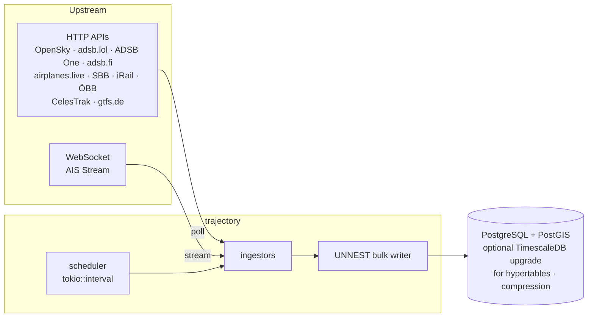
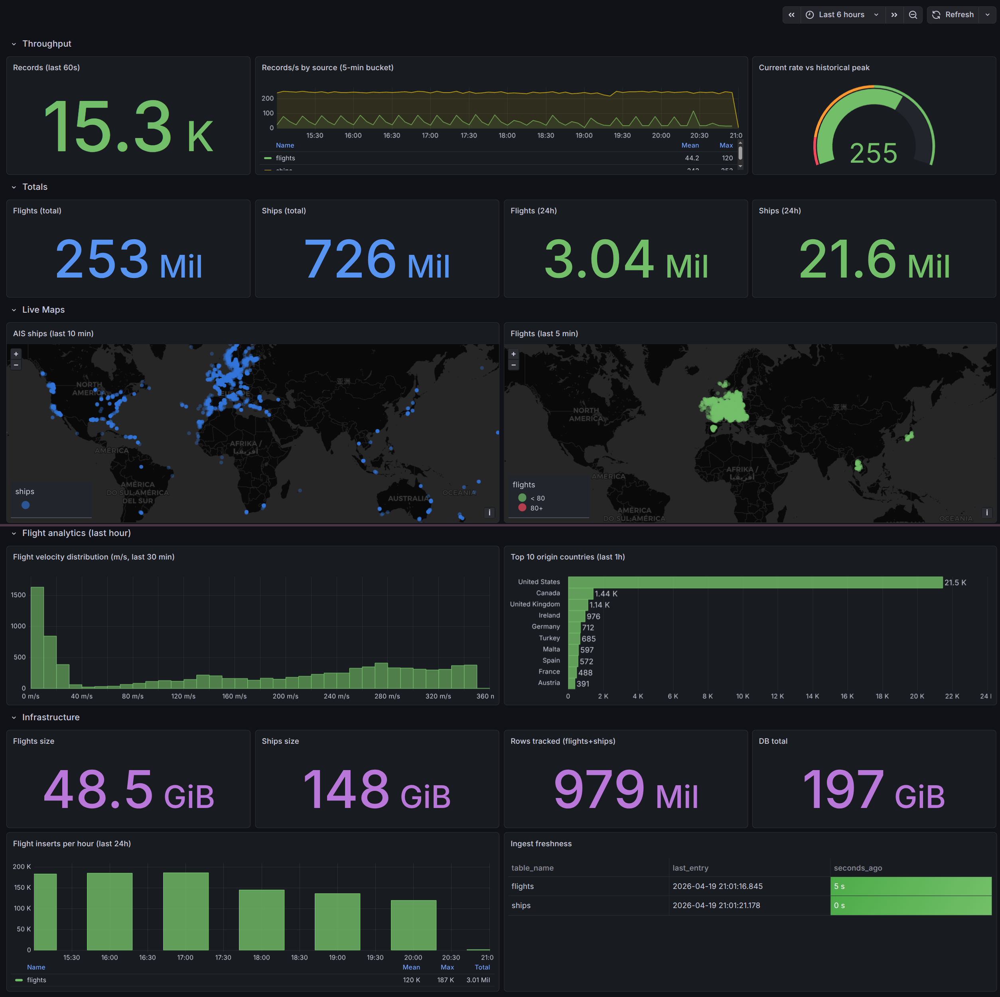

# trajectory

A Rust daemon that ingests real-time trajectories — aircraft, ships, trains, and satellites — into PostgreSQL/TimescaleDB.

[](https://github.com/USER/trajectory/actions/workflows/ci.yml)
[](LICENSE)
[](Cargo.toml)

## What it does

`trajectory` polls roughly a dozen public aviation, maritime, rail, and orbital data feeds on independent intervals, parses each payload on a Tokio runtime, and writes normalized rows into PostgreSQL using bulk `UNNEST` inserts. AIS messages arrive over a persistent WebSocket with permessage-deflate compression (via `yawc`, because `tokio-tungstenite` does not implement RFC 7692). The baseline target is plain PostgreSQL 15 + PostGIS; [an optional TimescaleDB upgrade path](sql/schema_timescaledb.sql) adds hypertables and compression for long-horizon retention. The daemon is designed for homelab-scale deployment: single binary, systemd-managed, resident around a few hundred MB of RSS.

## Architecture



See [ARCHITECTURE.md](ARCHITECTURE.md) for design decisions, failure modes, and security considerations.

## Metrics (production deployment, 2026-01-12 to 2026-04-19)

| Metric | Value |
|---|---|
| Total records | 979 M |
| &nbsp;&nbsp;&nbsp;&nbsp;Flights | 253 M |
| &nbsp;&nbsp;&nbsp;&nbsp;Ships (AIS) | 726 M |
| Average throughput | 117 rec/s |
| Peak (1 h) | 297 rec/s |
| Peak (10 min) | 291 rec/s |
| Peak (1 min) | 468 rec/s (28 109 inserts) |
| Deployment window | 97 days continuous |
| Current release uptime | 3 weeks stable (since 2026-03-29 AIS WebSocket fix) |
| Active tables in production | `flights`, `ships` (the 253 M + 726 M figures). `vehicle_positions`, `satellites`, `db_departures` are wired but deployment-dormant. |
| p99 ingest latency | instrumented via per-row `ingested_at` column; query in [`sql/queries/latency.sql`](sql/queries/latency.sql) |

## Quickstart

Requires Rust 1.88+, Docker (for the database), and `protoc` for the GTFS-RT build step (`sudo apt install protobuf-compiler` on Debian/Ubuntu).

```bash
# 1. Start PostgreSQL 15 + PostGIS (schema.sql runs automatically on first boot)
docker compose up -d postgres

# 2. Configure
cp .env.example .env
$EDITOR .env

# 3. Run the daemon
cargo run --release -- daemon
```

Optional: to enable TimescaleDB hypertables + compression + retention, install
the extension on the cluster and run:

```bash
docker compose exec -T postgres psql -U trajectory -d trajectory < sql/schema_timescaledb.sql
```

Ad-hoc single-source fetch (e.g. for backfill or debugging):

```bash
cargo run --release -- fetch opensky
cargo run --release -- fetch gtfs-rt
cargo run --release -- db-test
```

## Configuration

All configuration is via environment variables; a `.env` file is read at startup if present.

### Connection

| Variable | Default | Purpose |
|---|---|---|
| `DATABASE_URL` | `postgres://localhost/trajectory` | PostgreSQL DSN |
| `DATA_DIR` | `./data` | directory for GTFS static archives |
| `RUST_LOG` | `info` | `tracing-subscriber` env-filter |

### Credentials

| Variable | Required when | Purpose |
|---|---|---|
| `AIS_API_KEY` | `AIS_ENABLED=1` | aisstream.io API key |
| `OPENSKY_USERNAME` / `OPENSKY_PASSWORD` | never (optional) | raises OpenSky Network rate limits |
| `BRATWURST_LOGIN_URL` / `BRATWURST_API_URL` / `BRATWURST_USERNAME` / `BRATWURST_PASSWORD` | `ADSB_BRATWURST_ENABLED=1` | private feeder auth (all four required together) |

### Source toggles (default `1`)

| Variable | Source |
|---|---|
| `AIS_ENABLED` | AIS Stream WebSocket |
| `SATELLITES_ENABLED` | CelesTrak TLE |
| `TRAINS_ENABLED` | SBB, iRail, ÖBB |
| `GTFS_RT_ENABLED` | gtfs.de realtime |
| `GTFS_STATIC_ENABLED` | 12 European GTFS archives |
| `ADSB_OPENSKY_ENABLED` | OpenSky Network |
| `ADSB_LOL_ENABLED` | adsb.lol |
| `ADSB_FI_ENABLED` | adsb.fi |
| `ADSB_ONE_ENABLED` | ADSB One |
| `ADSB_AIRPLANESLIVE_ENABLED` | airplanes.live |
| `ADSB_BRATWURST_ENABLED` | private feeder |

### Intervals

| Variable | Default | Notes |
|---|---|---|
| `FLIGHTS_INTERVAL_SECS` | `300` | ADS-B sources run sequentially per tick |
| `TRAINS_INTERVAL_SECS` | `900` | SBB → iRail → ÖBB sequential |
| `GTFS_RT_INTERVAL_SECS` | `120` | protobuf payload is 28–34 MB |
| `GTFS_STATIC_INTERVAL_SECS` | `86400` | daily |
| `SATELLITES_INTERVAL_SECS` | `21600` | 6 hours |
| `BRATWURST_INTERVAL_SECS` | `60` | private feeder cadence |
| `ADSB_ONE_DELAY_MS` | `1500` | between sequential type-queries |
| `AIS_DEDUP_ENABLED` | `1` | coord-rounded per-MMSI de-dup before insert |

### Retention (days; optional)

If unset, no retention policy is registered. Setting any value applies `add_retention_policy` on startup (idempotent).

| Variable | Target table |
|---|---|
| `RETENTION_SHIPS_DAYS` | `ships` |
| `RETENTION_FLIGHTS_DAYS` | `flights` |
| `RETENTION_DEPARTURES_DAYS` | `db_departures` |
| `RETENTION_VEHICLE_POSITIONS_DAYS` | `vehicle_positions` |
| `RETENTION_SERVICE_ALERTS_DAYS` | `service_alerts` |

## Operations

A hardened systemd unit lives at [`systemd/trajectory.service`](systemd/trajectory.service). `systemd-analyze security` reports **exposure 1.5 (OK)**; the highlights:

| Directive | Why |
|---|---|
| `User=trajectory`, `Group=trajectory` | dedicated unprivileged service account |
| `CapabilityBoundingSet=` (empty) | strip every `CAP_*`; daemon only does user-space TLS + Postgres I/O |
| `NoNewPrivileges=yes` | `setuid`/`setgid` binaries cannot elevate |
| `ProtectSystem=strict` + `ProtectHome=yes` | entire FS read-only except `ReadWritePaths=` |
| `ReadWritePaths=/var/lib/trajectory` | only the GTFS archive directory is writable |
| `PrivateTmp`, `PrivateDevices` | no shared `/tmp` surface, no raw device access |
| `ProtectKernel{Tunables,Modules,Logs}=yes` | no `sysctl`, no `modprobe`, no kernel log reads |
| `ProtectProc=invisible`, `ProcSubset=pid` | `/proc` shows only this service's own PIDs |
| `RestrictAddressFamilies=AF_INET AF_INET6 AF_UNIX` | no netlink, no packet sockets, no bluetooth |
| `RestrictNamespaces=yes` | no mount/pid/net/user namespace creation |
| `SystemCallFilter=@system-service` | typical service syscall set; blocks `@mount`/`@reboot`/`@swap`/`@module`/`@raw-io`/`@debug` |
| `MemoryDenyWriteExecute=yes` | no W^X violations — blocks JIT, but the daemon has no JIT |
| `LockPersonality`, `RestrictRealtime`, `RestrictSUIDSGID`, `RemoveIPC` | defense-in-depth |
| `MemoryMax=1500M`, `TasksMax=256` | hard ceiling matching observed peak RSS |

### Install

```bash
sudo useradd --system --home /var/lib/trajectory --create-home trajectory

sudo install -m 755 target/release/trajectory /usr/local/bin/trajectory

sudo install -d -m 750 -o root -g trajectory /etc/trajectory
sudo install -m 640 -o root -g trajectory .env /etc/trajectory/trajectory.env

sudo install -m 644 systemd/trajectory.service /etc/systemd/system/

sudo systemctl daemon-reload
sudo systemctl enable --now trajectory

journalctl -u trajectory -f
```

Verify the sandbox:

```bash
systemd-analyze security trajectory.service
```

### Grafana



*(Screenshot pending — dashboard lives at `grafana/trajectory.json`.)*

## Development

```bash
cargo fmt --check
cargo clippy --all-targets -- -D warnings
cargo test
cargo build --release
```

CI runs these on stable and the declared MSRV on every push; see [`.github/workflows/ci.yml`](.github/workflows/ci.yml).

## License

MIT &mdash; see [LICENSE](LICENSE).
